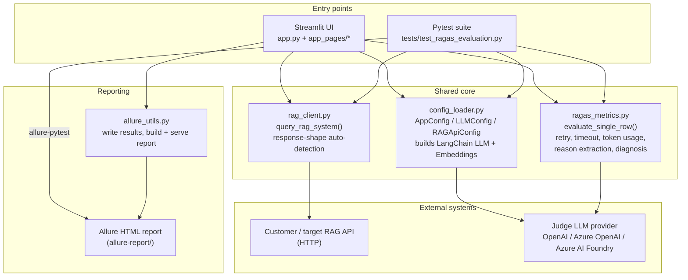
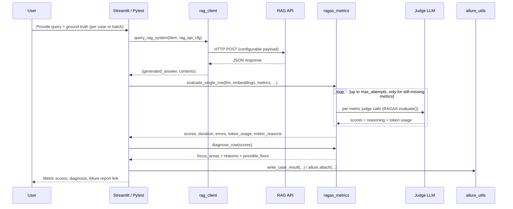

# RAGAS Evaluation Framework — Technical Document

**Audience:** Technical Lead / Engineering Review
**Scope:** Architecture, technology stack, and design rationale for the RAGAS-based RAG evaluation tool in this repository.

---

## 1. Purpose

This project is an internal QA tool that automatically scores the quality of a Retrieval-Augmented Generation (RAG) system's answers. It calls an external RAG API (or accepts manually supplied answers), runs four industry-standard [RAGAS](https://docs.ragas.io) metrics against each question/answer/context/ground-truth quadruple, and produces both an interactive Streamlit report and an Allure test report. It also includes a lightweight rule-based diagnosis engine that maps low scores back to a specific stage of the RAG pipeline (Retrieval / Augmentation / Generation).

It supports two independent ways of running the same evaluation logic:
1. **Streamlit UI** — ad-hoc, single-case or batch evaluation, run interactively.
2. **Pytest suite** — scriptable/CI-friendly batch evaluation over a JSON test-data file, with Allure reporting.

Both entry points share the same core evaluation module (`ragas_metrics.py`) so behavior can't drift between the two.

---

## 2. Technology Stack

| Layer | Technology | Purpose in this project |
|---|---|---|
| Language / runtime | **Python 3.9+** (developed/tested on 3.14) | Single-language implementation for UI, evaluation engine, and test suite. |
| Evaluation engine | **[RAGAS](https://docs.ragas.io) (`ragas>=0.1.21`)** | Provides the four evaluation metrics (`ResponseRelevancy`, `Faithfulness`, `ContextPrecision`, `ContextRecall`), the `evaluate()` runner, `RunConfig` (timeout/retry/concurrency control), and cost/token tracking. This is the core scoring library the rest of the project is built around. |
| LLM orchestration | **LangChain** (`langchain`, `langchain-community`, `langchain-openai`, `langchain-azure-ai`) | Provides a uniform `BaseLanguageModel`/`Embeddings` interface across providers so RAGAS can call any of them the same way. `LangchainLLMWrapper` / `LangchainEmbeddingsWrapper` (RAGAS-provided) wrap these clients to get RAGAS's markdown-fence-safe JSON parsing and self-correction retries. |
| LLM providers (judge model) | **OpenAI API** (`openai`, via `ChatOpenAI`) · **Azure OpenAI** (`AzureChatOpenAI`) · **Azure AI Foundry** (`azure-ai-inference`, `langchain-azure-ai`, plus an OpenAI-v1-compatible path for newer Foundry endpoints) | The LLM that acts as the "judge" scoring each metric. Three provider integrations are supported and selectable at runtime; the app is provider-agnostic beyond `config_loader.py`. |
| Web UI framework | **Streamlit (`streamlit>=1.30.0`)** | Renders the interactive dashboard, evaluation forms, per-case/batch results, sidebar configuration (LLM provider, RAG API, metrics selection), and live progress during long-running batch evaluations. Chosen for fast internal-tool development without a separate frontend stack. |
| Test framework | **pytest (`pytest>=7.4.0`)** | Drives the scriptable/CI evaluation path (`tests/test_ragas_evaluation.py`) via fixtures in `conftest.py`; supports CLI flags and env-var overrides for test data source. |
| Test reporting | **Allure (`allure-pytest`, Allure Commandline 2.29.0)** | Produces a browsable HTML test report (per-case inputs/outputs/scores, judge-LLM reasoning, session-level averages). The CLI is auto-downloaded into a local `.tools/` folder on first use (only a JRE is required as a prerequisite) so no manual Allure install is needed. |
| RAG integration | **`requests`** | Generic HTTP client used to call the external RAG system under test; response-shape auto-detection means it works against many RAG API contracts without code changes. |
| Data handling | **`datasets`** (HuggingFace `Dataset`), **`pandas`** | `datasets.Dataset` is RAGAS's required input container for `evaluate()`; `pandas` is used to pull the scored row back out (`result.to_pandas()`) and elsewhere for report shaping. |
| Configuration | **`pyyaml`** | Parses/writes `config.yaml` (LLM provider credentials, RAG API settings, metric selection, Allure output directory). Config is dataclass-typed (`config_loader.py`) rather than passed around as raw dicts. |
| Packaging / env | **`venv`** + shell/batch launcher scripts (`run_app.sh`/`.bat`, `run_evaluation.sh`/`.bat`) | Zero-manual-setup onboarding: creates a virtualenv, installs `requirements.txt`, seeds `config.yaml` from a template, and launches the app/tests in one command, cross-platform (macOS/Linux via bash, Windows via `.bat`). |

---

## 3. High-Level Architecture



### Component responsibilities

| File | Responsibility |
|---|---|
| `app.py` | Streamlit router — defines the page set (`Dashboard`, `RAG Evaluation`) and navigation. |
| `app_pages/home.py` | Landing page linking to available evaluation tools. |
| `app_pages/rag_evaluation.py` | Main evaluation UI: provider/RAG-API sidebar config, Single Case and Batch evaluation modes, live progress, per-case and summary result rendering, Allure report trigger. |
| `config_loader.py` | Loads/validates `config.yaml` into typed dataclasses (`AppConfig`, `LLMConfig`, `RAGApiConfig`); builds provider-specific, RAGAS-wrapped LangChain LLM/embeddings clients; persists sidebar edits back to `config.yaml`. |
| `rag_client.py` | Calls the target RAG API and extracts `(generated_answer, contexts)` from its response, auto-detecting common field-name/shape variants, with manual override support and path-based (dotted/array) field resolution for nested responses. |
| `ragas_metrics.py` | The evaluation engine shared by both entry points: builds/runs the four RAGAS metrics with a tuned `RunConfig`, retries only the metrics still missing after an attempt, captures the real per-metric failure reason (not just NaN), tracks token usage, extracts the judge LLM's own reasoning per metric, and implements `diagnose_row()` — a rules engine mapping metric-score patterns to Retrieval/Augmentation/Generation focus areas. |
| `allure_utils.py` | Writes Allure result JSON + attachments directly from the Streamlit UI (no pytest dependency), auto-downloads the Allure CLI if missing, builds and serves the HTML report over local HTTP. |
| `conftest.py` | Pytest fixture chain: config → LLM/embeddings → test dataset (file/CLI/env-driven) → live RAG responses. |
| `tests/test_ragas_evaluation.py` | The pytest entry point: evaluates every configured test case against the configured metrics, attaches full detail to Allure, fails the run with an aggregated summary if any metric couldn't be computed. |
| `config.yaml` / `config.yaml.temp` | Runtime configuration: LLM provider + credentials, RAG API endpoint/payload/timeout, which RAGAS metrics to run, Allure output directory. The real file is gitignored; `.temp` is the checked-in template. |

---

## 4. Evaluation Pipeline (Data Flow)



### The four RAGAS metrics

| Metric | Judges | What a low score means |
|---|---|---|
| **Response Relevancy** | Generated answer vs. the actual question asked | The answer doesn't directly address what was asked. |
| **Faithfulness** | Generated answer vs. its own retrieved context | The answer isn't grounded in the context it was given (possible hallucination). |
| **Context Precision** | Retrieved context vs. ground truth | Useful chunks aren't ranked near the top — retrieval ranking/noise. |
| **Context Recall** | Retrieved context vs. ground truth | Retrieved context doesn't cover everything the correct answer needs. |

`diagnose_row()` (`ragas_metrics.py`) combines these four scores into an automated, rule-based read on which pipeline stage — Retrieval, Augmentation, or Generation — most likely needs attention, with a concrete checklist of things to inspect per area. It is explicitly presented as a starting point, not a confirmed root cause (see `DIAGNOSIS_DISCLAIMER`).

---

## 5. Multi-LLM Provider Support

`config_loader.py` abstracts three distinct provider integrations behind one interface (`build_langchain_llm` / `build_langchain_embeddings`), selected via `config.yaml`'s `llm_provider`:

| Provider | Client used | Notes |
|---|---|---|
| **OpenAI** | `langchain_openai.ChatOpenAI` / `OpenAIEmbeddings` | Standard OpenAI API, API-key auth. |
| **Azure OpenAI** | `langchain_openai.AzureChatOpenAI` / `AzureOpenAIEmbeddings` | Classic Azure OpenAI resource + deployment routing. |
| **Azure AI Foundry** | `langchain_azure_ai.chat_models.inference.AzureAIChatCompletionsModel` (classic serverless), or a plain `ChatOpenAI` pointed at Foundry's OpenAI-v1-compatible endpoint | Two Foundry API shapes exist and are auto-distinguished by URL pattern (`/openai/v1` in the endpoint). |

All three are wrapped in RAGAS's `LangchainLLMWrapper` / `LangchainEmbeddingsWrapper` rather than passed to metrics as raw LangChain objects — required for RAGAS's markdown-fence-safe JSON parsing and self-correction retry; a raw client crashes the first time the model wraps its JSON answer in a ` ```json ` code fence.

Credentials can come from `config.yaml` or environment-variable overrides (`OPENAI_API_KEY`, `AZURE_OPENAI_API_KEY`, `AZURE_OPENAI_ENDPOINT`, `RAG_API_ENDPOINT`), so secrets don't have to live only in the YAML file.

---

## 6. Reliability / Engineering Decisions Worth Flagging

These are non-obvious choices made to handle real failure modes observed in practice — worth a technical lead's attention specifically:

- **Per-metric, not per-row, retries.** `evaluate_single_row()` only re-runs metrics that are still missing after an attempt, since `context_precision`/`context_recall` are far more expensive (one sequential LLM call per retrieved context chunk) than the other two. A single flaky call no longer forces a full row re-score.
- **Tight, explicit `RunConfig`.** RAGAS's defaults (`timeout=180s`, `max_retries=10`) mean a bad credential or slow deployment can silently retry for 10+ minutes. This project overrides that to fail fast and predictably (`EVAL_RUN_CONFIG`: `timeout=120s`, `max_retries=2`, `max_workers=4`), and separately tightens credential-check calls (`RunConfig(timeout=30, max_retries=2)`).
- **Real failure reasons, not bare NaN.** RAGAS's executor swallows every per-job exception and returns NaN. A custom logging handler (`_JobErrorCapture`) recovers the actual exception (timeout, 429 rate limit, malformed JSON, auth error, etc.) and attributes it back to the specific metric, so failures are diagnosable instead of opaque.
- **Judge-LLM reasoning is preserved, not thrown away.** `_PromptRecorder` wraps each metric's internal reasoning prompt to capture its structured (verdict, reason) output before RAGAS reduces it to a single float — surfaced in both the UI tooltips and Allure attachments, at no extra LLM cost (the tokens were already being generated/billed).
- **Windows event-loop fix.** `ragas.evaluate()` opens/closes a fresh asyncio event loop on every attempt; on Windows, the default Proactor loop's `close()` can hang forever if an async HTTP client is reused across those loops. Fixed by switching to `WindowsSelectorEventLoopPolicy` at import time, plus an optional `rebuild_clients` hook so each retry attempt gets fresh, never-reused LLM/embeddings clients.
- **`MAX_CONTEXTS` ceiling.** Since `context_precision` cost scales linearly with the number of retrieved chunks, rows exceeding a configurable ceiling (default 15) fail fast with a clear `TooManyContextsError` instead of silently blowing the timeout budget.
- **Token usage tracking.** Every judge-LLM call's token usage is summed per row (`_parse_token_usage`, handling both OpenAI-style and Azure AI Foundry's differently-named usage fields) and surfaced in both the UI and Allure reports for cost visibility.

---

## 7. Reporting

Two consumers write into the same `allure-results/` directory, so a single Allure report can combine results from ad-hoc UI runs and scripted pytest runs:

- **Streamlit UI** → `allure_utils.write_case_result()` writes Allure result JSON + attachments (inputs, scores, judge reasoning) directly, without invoking pytest.
- **Pytest suite** → the standard `allure-pytest` plugin, driven by `@allure.step` / `allure.attach` calls in `tests/test_ragas_evaluation.py`.

The Allure Commandline tool itself is not a project dependency to install manually — `allure_utils.ensure_allure_cli()` checks `PATH`, then a local `.tools/` cache, and only downloads the official release zip (Allure 2.29.0) if neither is found. The only external prerequisite is a Java runtime. Generated reports are served over a local `ThreadingHTTPServer` (Allure's report needs `http://`, not `file://`, since it fetches its data via JS).

Report contents per case: query, ground truth, generated answer, contexts, all four metric scores with quality labels (EXCELLENT/GOOD/MODERATE/POOR), token usage, and the automated diagnosis — plus a session-level summary with averages across all cases.

---

## 8. Configuration Surface

All runtime behavior is driven by `config.yaml` (gitignored; `config.yaml.temp` is the checked-in template), covering:

- `llm_provider` + one of `openai:` / `azure:` / `foundry:` credential blocks
- `rag_api:` — endpoint, timeout, headers, request payload shape (per-field: pulled from test-case JSON vs. hardcoded), and optional response-field overrides for non-standard RAG API response shapes
- `ragas:` — which of the four metrics to run, batch concurrency (`batch_size`)
- `allure:` — results directory, report title

The Streamlit sidebar can both pre-fill from and write back to this file (`save_llm_config` / `save_rag_api_config`), so credentials entered in the UI persist for future runs without hand-editing YAML.

---

## 9. Running the Project

| Task | Command |
|---|---|
| Launch UI (auto-installs everything) | `./run_app.sh` (macOS/Linux) or `run_app.bat` (Windows) |
| Run scripted evaluation + Allure report | `./run_evaluation.sh --test-data-file test_data/my_tests.json` |
| Run pytest directly | `pytest tests/test_ragas_evaluation.py --test-data-file <path>` |
| Share the project without leaking credentials | `./package_for_share.sh` (excludes `config.yaml`, `.venv`, caches) |

No manual dependency installation is required in the common path — the launcher scripts create a `venv`, install `requirements.txt`, and seed `config.yaml` from the template on first run.

---

## 10. Current Limitations / Roadmap Notes

- The pytest path (`conftest.py`) builds LLM/embeddings clients once per session and reuses them across all rows/retries — fine on macOS/Linux, but the Windows event-loop hang mitigation (`rebuild_clients`) is currently only wired into the Streamlit path (`app_pages/rag_evaluation.py`), not the pytest suite.
- `diagnose_row()` is an automated *heuristic* read of four scores, not a substitute for a developer inspecting actual retrieved chunks / assembled prompts / raw model output — this is explicitly disclaimed in both the UI and Allure output.
- The "Query Generator" tool referenced on the dashboard (auto-generating test queries/ground truth) is listed as on the roadmap but not yet implemented (`app_pages/home.py`).
- Embedding-call token usage is not tracked (RAGAS's built-in cost tracking covers chat/completion calls only, not embeddings, which `response_relevancy` uses).
